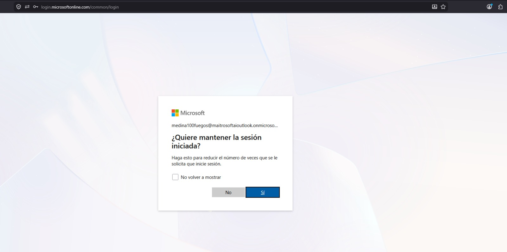
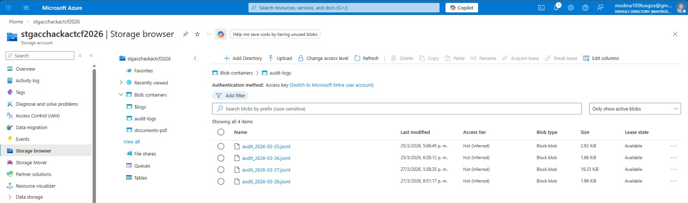

# URUS - Regulatory Intelligence Platform

URUS is an AI-powered document analysis and regulatory compliance assistant built for the Microsoft Azure AI Hackathon 2026. It enables legal professionals, compliance officers, healthcare administrators, and financial analysts to cross-reference internal system documentation against regulatory frameworks stored in a curated knowledge base, delivering structured compliance verdicts in real time.

---

## Table of Contents

1. [Overview](#overview)
2. [Why](#why)
3. [Design](#design)
4. [Features](#features)
   - [Auto-Track Detection](#auto-track-detection)
   - [Document Upload and Analysis](#document-upload-and-analysis)
   - [Regulatory Knowledge Base (RAG)](#regulatory-knowledge-base-rag)
   - [Conversational Memory](#conversational-memory)
   - [Content Safety and Audit Logging](#content-safety-and-audit-logging)
5. [How It Works](#how-it-works)
   - [Track Classification](#track-classification)
   - [Retrieval-Augmented Generation](#retrieval-augmented-generation)
   - [Grounding Score Evaluation](#grounding-score-evaluation)
   - [Security](#security)
6. [Architecture](#architecture)
7. [Technologies Used](#technologies-used)
8. [Challenges](#challenges)
9. [Impact](#impact)
10. [Future Enhancements](#future-enhancements)
11. [Contributing](#contributing)
12. [Demo](#demo)
13. [Screenshots](#screenshots)

---

## Overview

URUS connects your internal documentation to the body of law that governs your industry. Upload a system design PDF, internal policy, or technical specification and ask URUS whether it complies with the applicable regulatory framework. The assistant retrieves the relevant legal excerpts from Azure AI Search, reasons over them using GPT-4o mini, and delivers a structured verdict with citations and a grounding score.

The platform operates across four regulated domains: Legal, Compliance, Healthcare, and Finance. It automatically detects the domain from the user's question and switches persona, response structure, and citation behavior accordingly, without requiring any manual configuration from the end user.

---

## Why

Organizations across El Salvador and the broader region face significant barriers when attempting to self-audit their systems against evolving regulatory frameworks.

- Legal teams lack tooling to cross-reference technical documentation against specific articles of law at scale.
- Compliance officers spend hours manually reviewing policies against regulatory updates that arrive in unstructured PDF format.
- Healthcare institutions operating under data protection regulations have no lightweight mechanism to test system designs against privacy requirements before deployment.
- Financial institutions subject to NRP-23 and similar norms have no conversational interface to interrogate their own internal procedures against those standards.

URUS reduces that manual work to a single conversation.

---

## Design

The design of URUS is guided by four principles.

**Domain specificity over generality.** A generic chatbot cannot provide a structured compliance verdict. URUS activates a domain-specific expert persona for each query, with a pre-defined response structure that the model is instructed to follow.

**Transparency as a first-class feature.** Every response surfaces a grounding score, lists the documents consulted, and provides clickable citation panels with the full text excerpts used to generate the answer.

**Stateful conversation.** Uploaded documents persist across the entire session. A user who uploads their system architecture in message one can reference it twenty messages later without re-uploading.

**Responsible AI by default.** All user messages pass through Azure AI Content Safety before reaching the language model. Blocked categories are reported to the user with a clear message, and all interactions are logged to Azure Blob Storage for audit purposes.

---

## Features

### Auto-Track Detection

URUS reads the content of each user message and classifies it into one of four regulated domains: Legal, Compliance, Healthcare, or Finance. The classification is keyword-based and operates on the lowercased message content. Once a track is detected, the system prompt, response format, and citation behavior are all updated before the call to the language model is made. The detected track is displayed to the user in the loading indicator.

### Document Upload and Analysis

Users can attach PDF files directly in the chat interface. URUS extracts the full text of the document using PyPDF2 and stores it in the session. The document text is injected into every subsequent prompt as an evaluation target, allowing the model to cross-reference it against the knowledge base without the user needing to re-upload it in each message.

### Regulatory Knowledge Base (RAG)

Legal and regulatory documents are indexed in Azure AI Search using hybrid retrieval: vector similarity search over text embeddings generated by `text-embedding-3-small`, combined with full-text keyword search. The top results are retrieved and passed to the language model as grounded context. Multiple chunks from the same source document are consolidated into a single citation panel.

### Conversational Memory

URUS maintains a sliding window of the last ten messages in the session using `cl.user_session`. This allows the model to reference prior turns, build on previous answers, and maintain coherent reasoning across a multi-turn compliance dialog.

### Content Safety and Audit Logging

Every user message is screened through Azure AI Content Safety before processing. If blocked categories are detected, the request is rejected and the user is notified. All completed interactions, including the question, answer, documents used, response time, and grounding score, are written to a JSONL audit log stored in Azure Blob Storage.

---

## How It Works

### Track Classification

When a message arrives, the system converts it to lowercase and checks for the presence of domain-specific keywords. Legal indicators include terms such as "ley", "artículo", "statute", and "court". Compliance indicators include "kyc", "aml", "auditoría", and "policy". Healthcare indicators include "paciente", "hipaa", "clinical", and "ehr". Any message that does not match a more specific track defaults to the Finance persona.

Once a track is selected, a language instruction is also appended to the system prompt based on whether the message contains a sufficient number of English-language function words. If it does, the response is generated in English. Otherwise, the response is generated in Spanish.

### Retrieval-Augmented Generation

The user's message is embedded and used to query Azure AI Search. The top results are formatted as labeled context blocks with source identifiers. The user's uploaded document, if any, is appended as a second context block. Both are injected into the current user turn, not the system prompt, to avoid polluting the conversation history with repeated context.

### Grounding Score Evaluation

After the model produces an answer, a grounding score between 0.0 and 1.0 is computed. The score has two components. The citation component checks whether each retrieved document's identifier appears verbatim in the response text, weighted at 0.6. The overlap component measures the ratio of content words shared between the response and the retrieved snippets, weighted at 0.4, after filtering common stopwords in both Spanish and English. A score above 0.7 is labeled High confidence, between 0.4 and 0.7 is Medium, and below 0.4 is Low.

### Security

Authentication is handled via Microsoft Entra ID OAuth. Only users with accounts in the configured Azure tenant can access the application. The custom domain `urus.solutions` is used to ensure consistent cookie behavior for OAuth state validation. All secrets are stored as environment secrets in Azure Container Apps and are never exposed in the application code or repository.

---

## Architecture

```
User Browser (urus.solutions)
        |
        v
Azure Container Apps
  Chainlit Application (app.py)
        |
        |-- Azure AI Content Safety (message screening)
        |-- Azure AI Search (hybrid vector + keyword retrieval)
        |-- Azure OpenAI GPT-4o mini (answer generation)
        |-- Azure OpenAI text-embedding-3-small (query embedding)
        |-- Azure Blob Storage (audit log persistence)
        |
  Microsoft Entra ID (OAuth authentication)
```

The container image is built and deployed automatically via GitHub Actions on every merge to the `main` branch. The workflow uses OpenID Connect federated identity to authenticate with Azure without storing long-lived credentials.

---

## Technologies Used

| Component | Technology |
|---|---|
| Application Framework | Chainlit |
| Language Model | Azure OpenAI GPT-4o mini |
| Embedding Model | Azure OpenAI text-embedding-3-small |
| Vector and Keyword Search | Azure AI Search (Hybrid) |
| Content Moderation | Azure AI Content Safety |
| Authentication | Microsoft Entra ID OAuth |
| Audit Logging | Azure Blob Storage |
| Containerization | Docker |
| CI/CD | GitHub Actions |
| Hosting | Azure Container Apps |
| PDF Parsing | PyPDF2 |
| Language | Python 3.10 |

---

## Challenges

**OAuth state validation across domains.** The default Chainlit cookie validation failed when the application was accessed through the custom domain due to domain-scoped cookie restrictions. The solution required standardizing all traffic through a single canonical domain and configuring all OAuth redirect URIs accordingly in Microsoft Entra ID.

**Duplicate document citations.** Azure AI Search returns individual text chunks rather than complete documents. When multiple chunks from the same source were retrieved, they generated duplicate citation buttons in the interface. The fix groups all chunks by their source identifier before building the UI elements, merging them into a single panel.

**Grounding score inaccuracy.** The initial scoring algorithm searched for numeric citation markers such as [1] and [2]. After switching to keyword-style citations using document names, the citation component of the score was always zero. The algorithm was updated to perform a substring match between each document identifier and the response text.

**Context window and token limits.** Generating a comprehensive compliance report for a multi-page regulatory framework routinely exceeded the initial maximum token limit of 500. The limit was increased to 2000 to allow complete analysis without truncation.

---

## Impact

URUS reduces the time required to produce an initial compliance assessment from hours of manual document review to a single conversational exchange. For institutions in El Salvador operating under NRP-23, anti-money-laundering regulations, data protection law, and healthcare privacy requirements, the ability to upload an internal document and receive a structured verdict with citations and confidence scoring represents a meaningful reduction in compliance burden.

The platform is domain-agnostic by design. The same retrieval and evaluation pipeline applies equally to legal research, clinical data governance, and financial risk assessment, making it extensible to any regulated industry with a documentable knowledge base.

---

## Future Enhancements

- Persistent conversation history across sessions using Azure Database for PostgreSQL Flexible Server and the Chainlit SQLAlchemy data layer.
- Structured compliance reports exported as PDF with full citation appendices.
- Multi-document session support allowing simultaneous cross-referencing of multiple uploaded files.
- Fine-grained role-based access control allowing different user roles to access different subsets of the knowledge base.
- Support for additional regulatory frameworks through indexed document collections segmented by jurisdiction and industry.

---

## Contributing

### Prerequisites

- Python 3.10 or later
- Docker
- An Azure subscription with the following services provisioned: Azure OpenAI, Azure AI Search, Azure AI Content Safety, Azure Blob Storage, Microsoft Entra ID application registration

### Steps to Run Locally

Clone the repository and copy the environment file template:

```bash
git clone https://github.com/jaime-sql/urus-hack-cf
cd urus-hack-cf
cp .env.example .env
```

Fill in the values in `.env` with your Azure service credentials, then create and activate a virtual environment:

```bash
python -m venv .venv
.venv\Scripts\activate        # Windows
source .venv/bin/activate     # macOS / Linux
pip install -r requirements.txt
```

Run the application locally:

```bash
chainlit run app.py -w
```

The application will be available at `http://localhost:8000`.

### Environment Variables

| Variable | Description |
|---|---|
| `AZURE_SEARCH_ENDPOINT` | Azure AI Search service endpoint |
| `AZURE_SEARCH_API_KEY` | Azure AI Search admin key |
| `AZURE_SEARCH_INDEX` | Name of the search index |
| `AZURE_OPENAI_ENDPOINT` | Azure OpenAI resource endpoint |
| `AZURE_OPENAI_API_KEY` | Azure OpenAI API key |
| `AZURE_OPENAI_DEPLOYMENT` | Deployment name for the chat model |
| `AZURE_OPENAI_EMBEDDING_DEPLOYMENT` | Deployment name for the embedding model |
| `OAUTH_AZURE_AD_CLIENT_ID` | Entra ID application client ID |
| `OAUTH_AZURE_AD_CLIENT_SECRET` | Entra ID application client secret |
| `OAUTH_AZURE_AD_TENANT_ID` | Entra ID tenant ID |
| `CHAINLIT_AUTH_SECRET` | Secret key for Chainlit session signing |
| `CHAINLIT_URL` | Public URL of the deployed application |
| `AZURE_STORAGE_CONNECTION_STRING` | Connection string for audit log Blob Storage |

---

## Demo

### Video Walkthrough

Click the thumbnail below to watch the full demo on Google Drive:

[](https://drive.google.com/file/d/1QAP_AquJhzn8hrGSPfw93armoU_E0zaU/view?usp=sharing)

### Presentation Slides

View the full project presentation (PowerPoint):

[📊 URUS — Project Presentation (OneDrive)](https://1drv.ms/p/c/a5083bdf893052fd/IQBuCd5W1cdcTZe0O5ojbBAQAbDhh2taAVeoE29bcwxocDA?e=DlnjHo)

---

## Screenshots

### Login




### Content Safety


### Audit Logs



